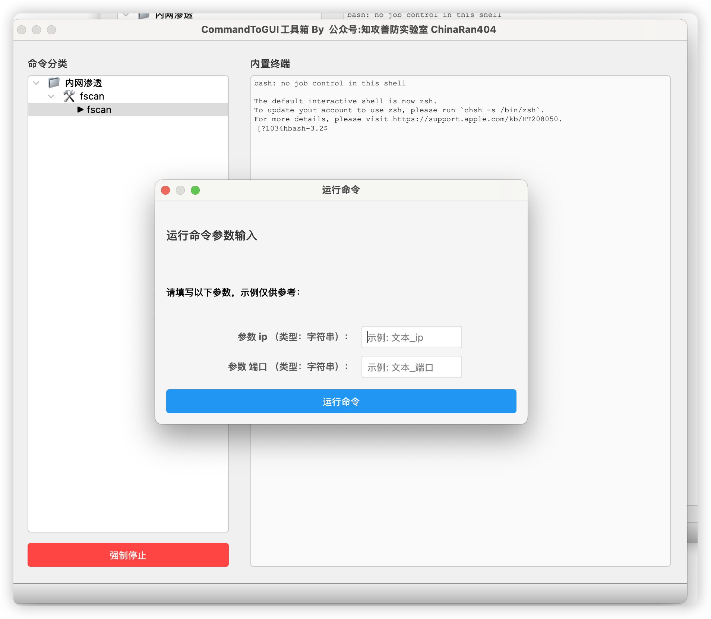

# CommandToGUI

以模板的方式加载命令行，实现命令懒得记，一次学习，终身使用

## 项目想法

一些常用的工具，全都是命令行版本，但是作为一名干网安的猴子，真的不想麻烦每次开终端，命令忘了翻--help

然后想着能不能写个小脚本来实现模板套用

## 支持系统

Windows/MacOS

## 下载地址

Windows&MacOS

https://pan.quark.cn/s/c92b798174ae


## 使用方式

下载打包好的工具

因为是 pyqt5 开发的，所以只支持py3.9一下版本，但是，可以直接下载打包好的版本去用


可以添加“分类”，“工具”，“命令”


以 fscan 为例子

我想执行fscan -h IP -p 端口


然后添加执行


如果你没有把工具路径添加到系统环境变量里面，需要写程序的完整路径

比如

```bash
/Users/user/SelfTools/fscan/fscan
```


选择参数类型，可选，“字符串”，”文件“，”字符串/文件“

然后就添加好了


双击会弹出来




数据持久化是使用的 json 文件，也可以从网络获取，方便共享大家的


如果你不想使用内置的终端，也可以使用外部终端


## 
